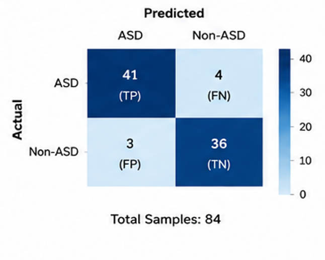
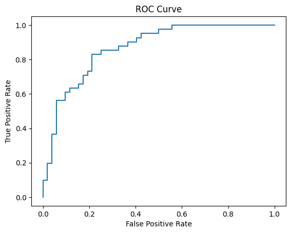
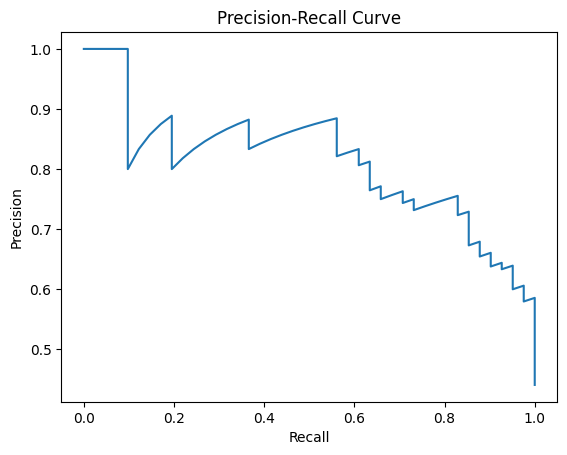
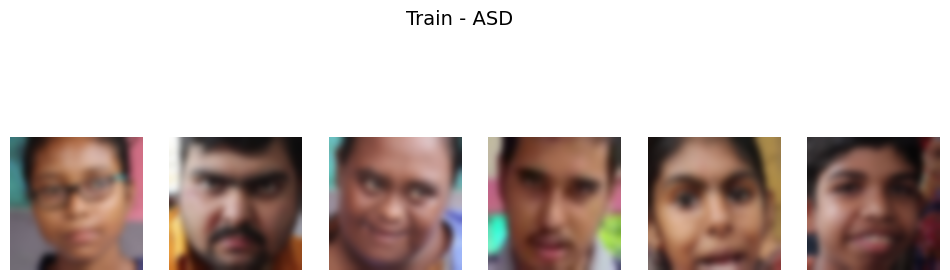
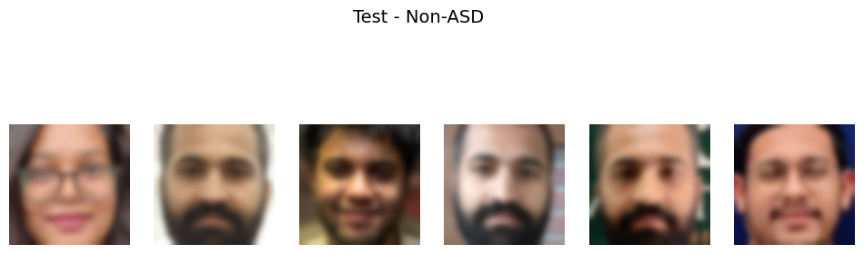

#  Autism Spectrum Disorder Detection using YOLOv5 & BiLSTM

<p align="center">

**An AI-assisted computer vision framework for ASD screening using facial video sequences and temporal behavioral analysis**


[](https://www.python.org/)
[](#yolov5--face-detection)
[](#bilstm--temporal-analysis)
[](#data-preprocessing)
[](#results)
[](#dataset)
[](https://ieeexplore.ieee.org/abstract/document/10963004)
[](#)

</p>

---

##  Overview

Autism Spectrum Disorder (ASD) is a complex neurodevelopmental condition in which behavioral characteristics can vary significantly between individuals. Conventional assessment involves detailed behavioral observation and clinical evaluation.

This project explores the application of **Computer Vision and Deep Learning** as an AI-assisted approach for ASD screening.

The proposed framework combines:

- **YOLOv5** for facial detection and localization
- **BiLSTM** for temporal sequence modeling
- **Video frame analysis** for capturing changes across time
- **Data preprocessing and augmentation** for improving model robustness
- **Person-wise dataset splitting** to prevent data leakage

Rather than analyzing each facial image independently, the system attempts to learn both **facial characteristics and temporal behavioral patterns** from sequences of frames.

>  **This is an academic/research prototype and is not intended to replace professional clinical diagnosis.**

---

#  Motivation

The motivation for this work came from studying existing research on the application of **Machine Learning, Computer Vision, facial analysis, eye-tracking, behavioral analysis, and other AI techniques for ASD screening**.

As part of this research, we conducted a literature review covering existing clinical and technological approaches to ASD diagnosis and screening.

This work resulted in the publication of our review paper:

###  Research Publication

**"Exploring Machine Learning Approaches for Diagnosing Autism Spectrum Disorder: Insights from Clinical and Technological Approaches"**

Published in:

**2025 AI-Driven Smart Healthcare for Society 5.0 – IEEE**

The review examined existing approaches and helped identify opportunities for developing AI-based systems that can analyze behavioral and visual information.

🔗 **IEEE Xplore:**  
https://ieeexplore.ieee.org/abstract/document/10963004

**DOI:** `10.1109/IEEECONF64992.2025.10963004`

---

#  Project Objective

The primary objective is to develop an AI-assisted system capable of distinguishing between:

```text
ASD
 │
 └── Autism Spectrum Disorder

Non-ASD
 │
 └── Control / Non-ASD
```

using facial information extracted from images and video sequences.

The project focuses particularly on combining **spatial facial information** with **temporal behavioral information**.

---

#  Key Idea / USP

A major limitation of analyzing individual facial images is that an image represents only a **single moment in time**.

However, behavioral characteristics can involve changes over time.

Therefore, our approach combines:

```text
               Facial Information
                      │
                      ▼
                   YOLOv5
                      │
              Face Detection
                      │
                      ▼
             Sequential Features
                      │
                      ▼
                   BiLSTM
                      │
            Temporal Learning
                      │
                      ▼
                Classification
                      │
                ┌─────┴─────┐
                ▼           ▼
               ASD       Non-ASD
```

### YOLOv5

Captures the **spatial/facial information** from individual frames.

### BiLSTM

Learns **temporal dependencies** across multiple frames.

Therefore, the system considers not only:

> **"What does the face look like?"**

but also:

> **"How does the facial information change across the sequence?"**

This spatial-temporal combination is the central idea of the project.

---

#  Dataset

A custom ASD dataset was collected from an **autism care centre in Shyamnagar**.

The dataset contains facial information from ASD children in the form of:

- Video recordings
- Facial images
- Extracted video frames

A corresponding Non-ASD dataset was prepared for binary classification.

### Dataset Structure

```text
ASD facial Data/
│
├── ASD/
│   ├── Person_1/
│   │   ├── Video/
│   │   └── Image/
│   │
│   ├── Person_2/
│   │   ├── Video/
│   │   └── Image/
│   │
│   └── ...
│
└── Non-ASD/
    ├── Person_1/
    ├── Person_2/
    └── ...
```

---

#  Video Frame Extraction

For every ASD video, approximately **15–18 uniformly distributed frames** were extracted.

Instead of extracting every frame, representative frames were selected at regular intervals.

### Why?

Consecutive video frames contain significant redundancy.

Extracting every frame would:

- Increase dataset size unnecessarily
- Produce highly similar samples
- Increase computational cost
- Increase the risk of overfitting

Uniform sampling allows the system to capture different moments throughout the video while maintaining a manageable dataset size.

---

#  Data Preprocessing

The preprocessing pipeline consists of:

```text
Raw Dataset
     │
     ▼
Video Frame Extraction
     │
     ▼
Face Detection
     │
     ▼
Face Cropping
     │
     ▼
Invalid Face Removal
     │
     ▼
Image Resizing
     │
     ▼
Normalization
     │
     ▼
Data Augmentation
     │
     ▼
Model Input
```

### Main preprocessing operations

- Video frame extraction
- Face detection
- Face cropping
- Removal of invalid/non-face images
- Image resizing
- Pixel normalization
- Data augmentation

---

#  Person-Wise Data Splitting

One of the most important aspects of this project was preventing **data leakage**.

During early experimentation, unusually high performance indicated that the dataset required further investigation.

We discovered that samples belonging to the same individual could potentially occur in both training and testing datasets.

For example:

```text
Person A

Frame 1 → TRAIN
Frame 2 → TRAIN
Frame 3 → TEST    ❌
```

This can cause the model to learn **person-specific facial characteristics** rather than generalizable ASD-related patterns.

Therefore, we implemented **person-wise splitting**:

```text
Person A → TRAIN ONLY

Person B → TRAIN ONLY

Person C → TEST ONLY

Person D → TEST ONLY
```

This ensures that an individual present in the training set cannot appear in the test set.

This was an important step toward obtaining a more reliable estimate of model generalization.

---

#  Model Architecture

## YOLOv5 + BiLSTM


The proposed pipeline can be summarized as:

```text
Video
  │
  ▼
Frame Extraction
  │
  ▼
YOLOv5 Face Detection
  │
  ▼
Face Cropping
  │
  ▼
Feature Representation
  │
  ▼
Sequence Formation
  │
  ▼
BiLSTM
  │
  ▼
Dense Layer
  │
  ▼
Sigmoid
  │
  ▼
ASD / Non-ASD
```

---

#  YOLOv5 – Face Detection

**YOLOv5 (You Only Look Once)** is used as the computer vision component of the pipeline.

For every input frame:

```text
Input Frame
     │
     ▼
   YOLOv5
     │
     ▼
Face Bounding Box
     │
     ▼
Face Crop
```

The detected facial region is extracted from the frame and used for subsequent processing.

YOLOv5 was selected because of its efficient object detection capabilities and suitability for processing image/video data.

---

#  BiLSTM – Temporal Analysis

After processing individual frames, the extracted information is organized into a sequence.

For example:

```text
Frame 1
   ↓
Frame 2
   ↓
Frame 3
   ↓
 ...
   ↓
Frame 16
```

This sequence is passed to the **Bidirectional Long Short-Term Memory (BiLSTM)** network.

A BiLSTM processes information in both directions:

```text
Forward:

Frame 1 → Frame 2 → Frame 3 → ... → Frame N


Backward:

Frame N → Frame N-1 → Frame N-2 → ... → Frame 1
```

This enables the network to learn temporal dependencies across the sequence.

The model can therefore learn changes in facial information across time rather than relying only on an isolated frame.

---

#  Classification Layer

The learned representation from the BiLSTM is passed through fully connected layers.

The final layer uses **Sigmoid activation** for binary classification.

```text
BiLSTM
   │
   ▼
Dense Layer
   │
   ▼
Sigmoid
   │
   ▼
Probability
   │
   ├───────────────┐
   ▼               ▼
  ASD           Non-ASD
```

The sigmoid produces a value between **0 and 1**, representing the model's confidence toward the positive class.

---

#  Training

The model was trained as a binary classification problem.

### Training Configuration

| Parameter | Configuration |
|---|---|
| Task | Binary Classification |
| Optimizer | Adam |
| Loss Function | Binary Cross-Entropy |
| Output Activation | Sigmoid |
| Learning Rate | `1 × 10⁻⁴` |
| Input | Facial image sequences |
| Temporal Model | BiLSTM |

Data augmentation and regularization techniques were used to reduce overfitting.

---

#  Results

The developed model achieved approximately:

# **92% Test Accuracy**

The model was evaluated using multiple metrics rather than relying solely on accuracy.

Evaluation included:

- Accuracy
- Precision
- Recall
- F1-score
- Confusion Matrix
- ROC-AUC
- Precision-Recall Curve

---

##  Model Performance

| Metric | Score |
| :--- | :---: |
|  **Accuracy** | **92.00%** |
|  **Precision (ASD)** | **0.91** |
|  **Recall (ASD)** | **0.90** |
|  **F1-Score (ASD)** | **0.90** |
|  **AUC-ROC** | **0.96** |

---

##  Confusion Matrix

<p align="center">

</p>

The confusion matrix provides a class-wise view of correct and incorrect predictions for ASD and Non-ASD samples.

---

##  ROC Curve

<p align="center">

</p>

The ROC curve represents the relationship between the **True Positive Rate** and **False Positive Rate** at different classification thresholds.

---

##  Precision-Recall Curve

<p align="center">

</p>

The Precision-Recall curve demonstrates the trade-off between precision and recall across different classification thresholds.

---

#  Sample Data

## Training – ASD

<p align="center">

</p>

Example samples from the ASD training dataset.

---

## Testing – Non-ASD

<p align="center">

</p>

Example samples from the Non-ASD testing dataset.

> **Privacy Notice:** Raw identifiable facial images of ASD children should not be publicly distributed without appropriate consent and authorization. The repository should contain only images that are cleared for public academic use.

---

#  Repository Structure

```text
ASD-Detection-using-YOLOv5-BiLSTM/
│
├── README.md
│
├── notebook/
│   └── model.ipynb
│
├── model/
│   └── classification_model
│
└── images/
    │
    ├── methodology_pipeline.png
    ├── performance_summary.png
    ├── confusion_matrix.png
    ├── roc_curve.png
    ├── precision_recall_curve.png
    ├── train_asd_samples.png
    └── test_non_asd_samples.png
```

---

#  Implementation

The complete experimental notebook is available at:

```text
notebook/model.ipynb
```

The trained classification model is available in:

```text
model/classification_model
```

The `images/` directory contains the methodology, sample data, and evaluation visualizations.

---

#  Technologies

| Technology | Application |
|---|---|
| Python | Development |
| YOLOv5 | Face Detection |
| BiLSTM | Temporal Sequence Learning |
| TensorFlow / Keras | Deep Learning |
| OpenCV | Image & Video Processing |
| NumPy | Numerical Processing |
| Pandas | Data Processing |
| Scikit-learn | Evaluation |
| Google Colab | Training Environment |

---

#  Research Background

This project was developed following a review of previous research in **AI-assisted ASD screening and diagnosis**.

Our literature study investigated different computational approaches including:

- Machine Learning
- Deep Learning
- Computer Vision
- Facial Feature Analysis
- Eye-Tracking
- Behavioral Analysis
- Speech Analysis
- Multimodal AI

The findings from this research helped inform the direction of the current project, particularly the use of visual and behavioral information for automated screening.


---

#  Medical & Ethical Disclaimer

This project is developed for **academic and research purposes**.

It should **not be interpreted as a clinical diagnostic or treatment system**.

Autism Spectrum Disorder requires comprehensive assessment by qualified healthcare professionals. The model is intended only as an exploration of AI-assisted screening and behavioral analysis.

Because the project involves sensitive facial data, appropriate consent, privacy protection, and ethical approval should be considered when collecting, storing, or distributing such data.

---

#  Author

### Joydeep Sarkar

**B.Tech – Computer Science and Business Systems**  
Institute of Engineering & Management, Kolkata

---

##  License

This repository is intended for **academic and research purposes**.

Please respect the privacy, consent, and usage restrictions associated with any dataset or model files included in this project.
