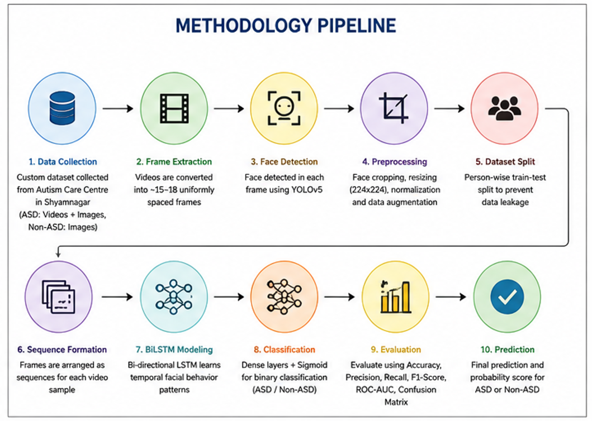
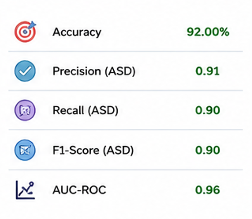

# 🧠 Autism Spectrum Disorder Detection using YOLOv5 and BiLSTM

A deep learning-based framework for **Autism Spectrum Disorder (ASD) screening** using facial images and video sequences. The proposed approach combines **YOLOv5** for facial detection and **Bidirectional Long Short-Term Memory (BiLSTM)** networks for learning temporal patterns from facial sequences.

> **Note:** This project is intended as an AI-assisted research and screening system and is **not a replacement for professional clinical diagnosis**.

---

## 📌 Project Overview

Autism Spectrum Disorder is a developmental condition associated with differences in communication, social interaction, attention, and behavior. Early screening can support timely intervention and monitoring.

Traditional ASD assessment relies heavily on behavioral observation and clinical evaluation. This project explores the use of **Computer Vision and Deep Learning** to analyze facial information and temporal behavioral patterns as a potential AI-assisted screening approach.

The proposed system combines:

- **YOLOv5** → Face detection and localization
- **BiLSTM** → Temporal sequence learning
- **Deep Learning** → ASD/Non-ASD classification
- **Person-wise data splitting** → Prevention of data leakage
- **Data preprocessing and augmentation** → Improved model generalization

---

# 🎯 Objectives

The major objectives of this project are:

1. Develop an AI-based framework for ASD screening.
2. Detect and extract facial regions from video frames.
3. Capture temporal changes in facial behavior.
4. Classify subjects into **ASD** and **Non-ASD** categories.
5. Prevent data leakage using person-wise dataset splitting.
6. Evaluate the model using multiple classification metrics.

---

# ⭐ Key Contribution / USP

The primary advantage of this project is that it does not rely solely on independent facial images.

Instead, it combines **spatial facial information with temporal behavioral information**.

### YOLOv5

YOLOv5 is used to detect and localize faces in individual frames.

### BiLSTM

BiLSTM processes the sequence of facial features across multiple frames and learns temporal dependencies.

Therefore, the system considers both:

**"What does the face look like?"**

and

**"How does the facial behavior change over time?"**

This spatial-temporal approach provides a more informative representation than classifying individual frames independently.

---

# 🏗️ Methodology



The overall workflow consists of the following stages:

```text
                 Dataset
                    │
                    ▼
             Video / Images
                    │
                    ▼
            Frame Extraction
              15–18 Frames
                    │
                    ▼
             Face Detection
                 YOLOv5
                    │
                    ▼
          Face Cropping & Cleaning
                    │
                    ▼
          Image Preprocessing
                    │
                    ▼
          Feature Representation
                    │
                    ▼
             Sequence Formation
                    │
                    ▼
                BiLSTM
                    │
                    ▼
             Dense Layer(s)
                    │
                    ▼
               Sigmoid
                    │
                    ▼
           ASD / Non-ASD
```

---

# 📂 Dataset

The project uses facial data from two categories:

```text
ASD
Non-ASD
```

### ASD Dataset

A custom ASD dataset was collected from an **autism care centre in Shyamnagar**.

The ASD data consists of:

- Facial images
- Short video recordings
- Frames extracted from the videos

### Non-ASD Dataset

Non-ASD facial samples were prepared as control data for binary classification.

---

# 🎥 Frame Extraction

For ASD video data, approximately **15–18 uniformly distributed frames** were extracted from each video.

Instead of extracting every frame, a fixed number of representative frames was selected.

### Why 15–18 frames?

Consecutive video frames are often highly similar. Extracting every frame would:

- Increase dataset size unnecessarily
- Introduce redundant samples
- Increase computational requirements
- Increase the possibility of overfitting

Uniform frame sampling provides a better representation of different moments in the video while reducing redundancy.

---

# 👤 Face Detection and Preprocessing

After frame extraction, facial regions are detected using **YOLOv5**.

The preprocessing pipeline includes:

- Face detection
- Face localization
- Face cropping
- Removal of invalid/non-face samples
- Image resizing
- Normalization
- Data augmentation

The objective is to provide the model with a consistent facial representation while reducing irrelevant background information.

---

# 🔀 Person-Wise Data Splitting

One of the most important aspects of this project is **preventing data leakage**.

During experimentation, unusually high performance indicated a possible overlap between individuals in the training and testing sets.

For example:

```text
Person A
 ├── Frame 1 → Training
 ├── Frame 2 → Training
 └── Frame 3 → Testing ❌
```

This allows the model to learn person-specific facial characteristics rather than general ASD-related patterns.

Therefore, a person-wise split was implemented:

```text
Person A → Training ONLY

Person B → Testing ONLY
```

This ensures that the same individual does not appear in both training and testing datasets.

This provides a more realistic evaluation of model generalization to unseen subjects.

---

# 🤖 Model Architecture

## YOLOv5

YOLOv5 is used as the computer vision component of the system.

Its role is primarily:

```text
Input Frame
     ↓
YOLOv5
     ↓
Face Detection
     ↓
Bounding Box
     ↓
Face Crop
```

YOLOv5 was selected because of its speed and effectiveness in object detection, making it suitable for processing video frames.

---

# 🔄 BiLSTM

After facial information is obtained from individual frames, the information is organized into sequences.

For example:

```text
Frame 1
   ↓
Frame 2
   ↓
Frame 3
   ↓
...
Frame 16
```

These sequential features are provided to the BiLSTM.

Unlike a standard LSTM, a BiLSTM processes information in two directions:

```text
Forward:

Frame 1 → Frame 2 → Frame 3 → ... → Frame N


Backward:

Frame N → Frame N-1 → Frame N-2 → ... → Frame 1
```

This allows the network to learn temporal dependencies from both directions.

The BiLSTM can therefore learn patterns associated with changes in:

- Facial expression
- Attention
- Gaze-related behavior
- Facial movements
- Other temporal facial characteristics

---

# 🧮 Classification

The output representation learned by the BiLSTM is passed to fully connected layers.

The final layer uses **Sigmoid activation** for binary classification.

```text
BiLSTM
   ↓
Dense Layer
   ↓
Sigmoid
   ↓
Probability
   ↓
ASD / Non-ASD
```

A probability closer to 1 indicates stronger confidence toward the ASD class, while a probability closer to 0 indicates stronger confidence toward the Non-ASD class.

---

# ⚙️ Training

The model is trained as a binary classification system.

### Training components

- **Loss Function:** Binary Cross-Entropy
- **Optimizer:** Adam
- **Learning Rate:** 1 × 10⁻⁴
- **Output Activation:** Sigmoid
- **Regularization:** Dropout / augmentation where applicable

Data augmentation is used during training to improve generalization and reduce overfitting.

---

# 📊 Results

The developed model achieved approximately:

## **92% Test Accuracy**

The model was evaluated using multiple performance metrics rather than relying only on accuracy.

The evaluation includes:

- Accuracy
- Precision
- Recall
- F1-score
- Confusion Matrix
- ROC-AUC
- Precision-Recall Curve

---

## 📈 Performance Summary



The performance summary provides an overview of the classification performance obtained during testing.

---

# 📉 Confusion Matrix


The confusion matrix provides a class-wise breakdown of the model's predictions.

It helps identify:

- Correct ASD predictions
- Incorrect ASD predictions
- Correct Non-ASD predictions
- Incorrect Non-ASD predictions

---

# 📈 ROC Curve


The ROC curve illustrates the relationship between:

- True Positive Rate
- False Positive Rate

at different classification thresholds.

A model with stronger discrimination between ASD and Non-ASD samples produces a ROC curve that is closer to the upper-left region.

---

# 📊 Precision-Recall Curve


The Precision-Recall curve shows the trade-off between:

- Precision
- Recall

at different classification thresholds.

This is particularly useful when evaluating classification performance beyond a single threshold.

---

# 🖼️ Sample Dataset

## Training ASD Samples


These samples demonstrate examples of facial data used during the training process.

---

## Testing Non-ASD Samples


These samples demonstrate examples from the Non-ASD testing data.

> For privacy and ethical reasons, raw identifiable images of ASD children should not be publicly uploaded to the repository without appropriate authorization.

---

# 🧪 Evaluation Metrics

The following metrics are used to evaluate the model:

### Accuracy

Measures the proportion of correctly classified samples.

\[
Accuracy = \frac{TP + TN}{TP + TN + FP + FN}
\]

### Precision

Measures how many predicted positive samples were actually positive.

\[
Precision = \frac{TP}{TP + FP}
\]

### Recall

Measures how many actual positive samples were correctly identified.

\[
Recall = \frac{TP}{TP + FN}
\]

### F1-Score

Provides a balance between precision and recall.

\[
F1 = 2 \times \frac{Precision \times Recall}{Precision + Recall}
\]

### ROC-AUC

Measures the model's ability to distinguish between the two classes across different classification thresholds.

---

# 📁 Repository Structure

```text
ASD-Detection-using-YOLOv5-BiLSTM/
│
├── README.md
│
├── notebook/
│   └── model.ipynb
│
├── model/
│   └── classification_model
│
└── images/
    │
    ├── roc_curve.png
    ├── precision_recall_curve.png
    ├── test_non_asd_samples.png
    ├── train_asd_samples.png
    ├── confusion_matrix.png
    ├── methodology_pipeline.png
    └── performance_summary.png
```

---

# 💻 Implementation

The complete experimental implementation is available in:

```text
notebook/model.ipynb
```

The trained classification model is provided in:

```text
model/classification_model
```

The notebook contains the experimental workflow including preprocessing, model training, and evaluation.

---

# 🛠️ Technologies Used

| Technology | Purpose |
|---|---|
| Python | Programming |
| YOLOv5 | Face Detection |
| BiLSTM | Temporal Sequence Learning |
| TensorFlow / Keras | Deep Learning |
| OpenCV | Image & Video Processing |
| NumPy | Numerical Processing |
| Pandas | Data Processing |
| Scikit-learn | Model Evaluation |
| Google Colab | Model Development & Training |

---

# 🚧 Challenges Addressed

### 1. Small Dataset

Deep learning models generally require large datasets. Data augmentation and transfer learning techniques were considered to improve generalization.

### 2. Video Redundancy

Instead of using every frame, 15–18 uniformly distributed frames were extracted from each video.

### 3. Face Detection

YOLOv5 was used to consistently locate and crop facial regions.

### 4. Data Leakage

Person-wise train-test splitting was implemented to ensure that the same subject does not occur in both training and testing sets.

### 5. Overfitting

Augmentation, regularization, and appropriate evaluation strategies were used to reduce overfitting.

---

# 🎯 Key Takeaways

This project provided practical experience in:

- Computer Vision
- Object Detection
- Deep Learning
- Sequence Modeling
- Video Processing
- Dataset Preparation
- Data Augmentation
- Data Leakage Detection
- Model Evaluation
- Python and TensorFlow/Keras

A particularly important learning outcome was understanding that **high accuracy does not necessarily indicate a good machine learning model**. Proper dataset splitting and leakage prevention are essential for obtaining trustworthy results.

---

# 🔮 Future Scope

The project can be further extended through:

### Larger Dataset

Collecting more subjects from different environments and demographic groups.

### Eye-Gaze Analysis

Integrating dedicated eye-tracking techniques to analyze gaze behavior.

### Multimodal Learning

Combining facial information with:

- Eye gaze
- Audio
- Body posture
- Behavioral signals

### Real-Time Deployment

Deploying the system for real-time video analysis.

### Explainable AI

Using techniques such as Grad-CAM and attention visualization to understand which facial regions influence model predictions.

### External Validation

Testing the model on completely independent datasets to evaluate its generalization capability.

---

# ⚠️ Ethical and Medical Disclaimer

This project is an academic/research prototype.

It **does not provide a medical diagnosis or cure for Autism Spectrum Disorder**.

ASD diagnosis requires comprehensive assessment by qualified healthcare professionals. The model should therefore be considered an **AI-assisted screening/research tool**, not a clinical diagnostic system.

Because the dataset includes sensitive facial information, raw identifiable images and videos should not be publicly distributed without appropriate consent and authorization.

---

# 👨‍💻 Author

**Joydeep Sarkar**

B.Tech – Computer Science and Business Systems  
Institute of Engineering & Management, Kolkata

---

# ⭐ Project Highlights

```text
✓ Custom ASD Dataset
✓ Autism Care Centre Data Collection
✓ YOLOv5 Face Detection
✓ 15–18 Frame Video Sampling
✓ BiLSTM Temporal Analysis
✓ Person-Wise Dataset Splitting
✓ Data Leakage Prevention
✓ Deep Learning Classification
✓ 92% Test Accuracy
✓ ROC & Precision-Recall Analysis
```

---

## 📌 Disclaimer

This project is developed for academic and research purposes. The reported results are based on the available dataset and evaluation methodology and should not be interpreted as evidence of clinical diagnostic performance.
